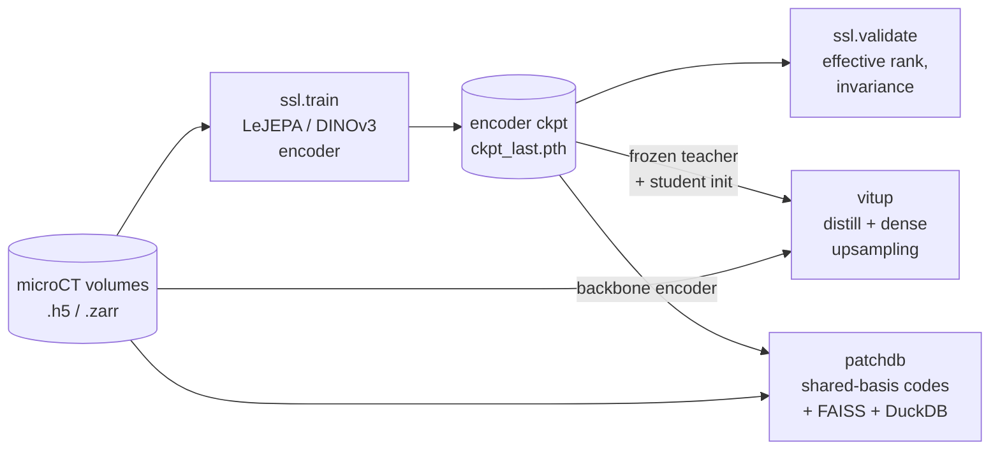

# tomojepa — Architecture

This document describes the architecture of **tomojepa**, a self-supervised
representation-learning stack for microCT tomography. It covers the shared core,
the data and **augmentation** pipeline, and the three subsystems (`ssl`,
`vitup`, `patchdb`), plus how they connect and how training scales across GPUs.

For usage/install see [`README.md`](README.md); for design background and common
questions see [`docs/FAQ.md`](docs/FAQ.md) and [`docs/RUN_LOCAL.md`](docs/RUN_LOCAL.md).

---

## 1. High-level overview

Three subsystems share **one** ViT backbone definition and **one** data loader:

| Package | Role | Entry point |
|---------|------|-------------|
| `tomojepa.ssl` | LeJEPA / DINOv3 self-supervised pre-training + label-free validation | `train-ssl`, `validate` |
| `tomojepa.vitup` | ViT-Up faithful feature upsampling (distillation + dense inference) | `train-vitup`, `infer-vitup` |
| `tomojepa.patchdb` | FAISS + DuckDB cross-image patch retrieval (CLI / API / MCP) | `patchdb …` |
| `tomojepa.core` | Shared: model, dataset, augmentations, distributed helpers | — |
| `tomojepa.viz` | PCA maps, A/B curves, shape probes, legacy token-DB tools | `viz …` |

The data flow between them is a one-directional pipeline — the SSL checkpoint is
the asset that feeds everything downstream:



The unified `tomojepa` CLI ([`src/tomojepa/cli.py`](src/tomojepa/cli.py)) is a thin
Typer dispatcher that forwards arguments verbatim to each subsystem's
`argparse` `main()`; the patchdb CLI is mounted as a Typer subgroup.

---

## 2. Shared core (`tomojepa.core`)

### 2.1 Data layer — `TomographyDataset`

[`core/dataset.py`](src/tomojepa/core/dataset.py) lazily slices a directory of 3-D
volumes into 2-D views.

- **Backends**: HDF5 (`.h5`) and Zarr (`.zarr`/`.zarr.zip`), auto-detected per
  file from the extension (override with `backend=`). Each volume holds a
  `(D, H, W)` (or `(D, C, H, W)`) array under `dataset_key` (default
  `reconstruction`).
- **Flat indexing**: a global slice index is mapped to `(file, depth-slice)`
  via per-file `scan_infos` ranges.
- **Worker-safe handles**: file handles are opened lazily *inside* `__getitem__`
  and held in an **LRU cache** (`max_open_files=64`), so each `DataLoader`
  worker opens its own handles after fork/spawn. Corrupt slices fall back to a
  zero image rather than crashing.
- **Multi-view output**: in train mode each `__getitem__` returns a stacked
  tensor of `global_views + local_views` augmented crops of the **same** slice
  (the views that LeJEPA's invariance term is computed across). In eval mode it
  returns a single deterministic `test_tf` view.

> Note: the SSL loader spins up workers with `multiprocessing_context="spawn"`
> (not fork). The model initializes CUDA in the main process first; a forked
> worker that inherits a live CUDA context deadlocks, so spawn gives each worker
> a clean interpreter.

### 2.2 Augmentations (`core/augmentations.py`)

Augmentations are the heart of the self-supervised signal: two views of the same
slice should map to nearby embeddings, so the augmentation set defines the
invariances the encoder learns. All transforms are `torchvision.transforms.v2`
modules operating on single-channel float tensors, composed per **scale band**.

**Two variants**, selected at runtime via `--augment {tomo, tomo2}`:

| Stage | `tomo` | `tomo2` (default) |
|-------|--------|-------------------|
| Pre: intensity windowing | ✓ | ✓ |
| `RandomResizedCrop` (scale band) | ✓ | ✓ |
| `RandomHorizontalFlip` / `RandomVerticalFlip` (p=0.5) | ✓ | ✓ |
| `RandomRotation(0–180°)` | — | ✓ |
| `RandomFloatEqualize` (p=0.5) | — | ✓ |
| `GaussianBlur` (p=0.5) | ✓ | ✓ |
| `PoissonNoise` (p=0.5) | ✓ | ✓ |
| `RandomPixelMask` (p=0.5) | ✓ | ✓ |
| `Normalize(mean=0.5, std=0.5)` | ✓ | ✓ |

**Custom (domain-specific) transforms:**

- **`CustomIntensityWindowing`** *(always applied first)* — clips to the
  `[p_low, p_high]` = `[0.01, 0.99]` intensity quantiles, then linearly
  normalizes to `[0, 1]`. Quantiles are estimated on a random 100k-pixel
  subsample for speed on large slices; `NaN`s are zeroed; a degenerate window
  (`q_high ≤ q_low`) yields a zero image. This is the reconstruction-agnostic
  contrast normalization that makes diverse microCT volumes comparable.
- **`PoissonNoise(scale=10000)`** — simulates photon shot noise: scale the
  image to photon counts, draw `torch.poisson`, scale back, and clamp. Encodes
  invariance to dose/exposure.
- **`RandomPixelMask(mask_ratio=0.15)`** — Bernoulli pixel dropout to zero; a
  denoising/robustness signal at the input level (distinct from the
  *token*-level MIM masking in §3.3).
- **`RandomFloatEqualize(p=0.5)`** *(tomo2 only)* — histogram-equalizes the
  float image by round-tripping through `uint8` and `v2.RandomEqualize`,
  decorrelating learned features from the global intensity histogram.

**Multi-scale views.** The pipeline is built once per scale band by
`_build_train_tf(variant, img_size, scale)`. The **only** difference between
"global" and "local" views is the `RandomResizedCrop` area-scale range:

- `global_scale=(0.4, 1.0)` → wide-area context views.
- `local_scale=(0.1, 0.4)` → aggressively zoomed-in views.

Both render at the same `img_size` (default 512) so all views stay stackable
into a single tensor. View counts are set per tier (`--global_views`,
`--local_views`, default 2 + 2). This global/local split is what gives the SSL
objective both scene-level and part-level invariance.

`get_augmentations()` returns `(global_tf, local_tf, test_tf)`. The **test
transform** is deterministic: intensity windowing → `Resize` → `CenterCrop` →
`Normalize` (no crop jitter, no noise), used for validation and for patchdb
encoding.

### 2.3 Distributed helpers (`core/dist.py`)

Multi-GPU is **opt-in** via `torchrun` and is implemented *without*
`DistributedDataParallel`. Two of the objectives are incompatible with DDP's
autograd-hook gradient sync:

- LeJEPA's **SIGReg** is a *distribution-level* statistic over the batch, so it
  must be evaluated on the **global** batch, not summed per-rank.
- The GradCache path uses a hand-written **two-pass** backward.

So the module provides manual primitives, all **no-ops** when `WORLD_SIZE == 1`:

- **`all_gather_cat(x, dim)`** — a differentiable all-gather (custom
  `autograd.Function`): forward concatenates every rank's tensor; backward
  returns only this rank's slice. Used to assemble the global projection batch.
- **`all_reduce_grads_(params)`** — in-place **SUM** all-reduce of parameter
  gradients. Combined with `all_gather_cat`, this reconstructs the exact
  full-batch gradient after the local backward.
- **`average_grads_(params)`** — standard data-parallel **mean** gradient
  averaging (SUM then divide), used by ViT-Up whose loss is a plain per-sample
  mean.
- **`sync_rng(seed)`** — seeds CPU+CUDA RNG identically across ranks right
  before SIGReg, so the random sketch directions match and the gathered loss is
  one coherent function.
- **`loss_scale()`** = `1 / world_size`, applied to per-sample (local-shard)
  terms before the SUM all-reduce so they become the global mean.

`init_distributed()` reads torchrun's env vars, picks `nccl` (CUDA) or `gloo`
(CPU), and returns `(device, local_rank)`. Rank 0 owns logging, visualization,
and checkpointing.

---

## 3. SSL subsystem (`tomojepa.ssl`) — LeJEPA / DINOv3

### 3.1 Model (`core/model.py`)

**`DINOv3ViTEncoder`** = a timm DINOv3 ViT-S backbone (`vit_small_patch16_dinov3`,
patch 16, `embed_dim=384`, `in_chans=1`) + a 3-layer MLP projection head
(`MLP(384, [2048, 2048, proj_dim])` with BatchNorm). The backbone is built with
`num_classes=embed_dim` (an extra linear head onto the 384-d feature) to match
the released-checkpoint architecture exactly. `forward(x)` takes `[N, V, C, H, W]`
multi-view input and returns `(emb, proj)` with `proj` shaped `[V, N, proj_dim]`.

**`lejepa_projections`** routes the invariance/SIGReg head. By default it
delegates to `DINOv3ViTEncoder.forward` (global backbone embedding). With
`--foreground_mask`, each view is mean-pooled over foreground patch tokens
(`foreground_tokens` + `masked_mean`) before `proj`, so holder/background
patches do not consume representational bandwidth.

### 3.2 SIGReg — collapse prevention

**`SIGReg`** (Sketched Isotropic Gaussian Regularizer) replaces the teacher/EMA
machinery of classic JEPA. It matches the empirical characteristic function of
the projected embeddings — measured along `n_sketches=256` random unit-norm 1-D
directions — to that of a standard isotropic Gaussian, integrated over a knot
grid with trapezoidal quadrature. Because it is a statistic over the **N samples
jointly**, it must see the whole (effective/global) batch.

The full SSL objective is:

```
loss = lamb * SIGReg(proj) + (1 - lamb) * invariance(proj)
invariance = mean( (proj.mean(over views) - proj)^2 )
```

with `lamb` default `0.02` (`lejepa_loss_terms` in `ssl/train.py`).

### 3.3 Optional MIM + residual factorization

When `--mim_weight > 0`, a masked-image-modeling head augments the objective:

- **`encode_masked`** injects a learnable `[MASK]` token at masked patch
  positions right after `patch_embed` (iBOT/BEiT style), then runs the backbone
  blocks (RoPE-aware) and returns the patch tokens.
- **`MaskedLatentPredictor`** holds the `[MASK]` token + a small MLP that maps
  the masked context to a **smooth latent field** `C` over all patches.
- **`make_block_mask`** lays down BEiT-style rectangular blocks to the target
  mask ratio (default 0.5).

`C` plays two roles (in `residual_view`):
1. **MAE loss** — smooth-L1 between `C` at masked positions and the stop-grad
   (optionally layer-normed) full-image target `T`.
2. **Residual** — with `--residual_local`, the LeJEPA invariance/SIGReg are
   routed through `z_local = proj(mean(T − sg(C)))`, making the invariant
   features *complementary* to the smooth context. An optional
   `--indep_weight` cross-covariance penalty (`decorr`) drives `z_local` and the
   pooled context toward linear independence.

**Foreground masking** (`foreground_tokens`, `--foreground_mask`): the sample
sits on a flat surround (holder/frame); near-constant background patches have
≈0 per-patch intensity std while textured sample patches have high std. A std
threshold (`--fg_std_thresh`, default 0.05) restricts LeJEPA invariance/SIGReg
pooling (via `lejepa_projections`), residual pooling, and the MIM target to
foreground tokens so capacity isn't spent on background. It falls back to
all-foreground for fully-interior crops.

### 3.4 Training loop (`ssl/train.py`)

Single-process by default; multi-GPU under `torchrun`. AdamW + linear warmup
(1 epoch) → cosine, AMP defaulting to bf16, automatic resume from
`ckpt_last.pth`. Two optimizer-step paths:

- **`simple_step`** (`--accum_steps 1`) — forward all views, gather projections
  across ranks (`all_gather_cat`), `sync_rng`, compute LeJEPA on the global
  batch, add scaled MAE/decorr, backward, `all_reduce_grads_`, step.
- **`gradcache_step`** (`--accum_steps > 1`) — **GradCache** two-pass:
  - *Pass 1 (no grad):* forward every microbatch, concatenate projections,
    gather across ranks, and evaluate the full-batch LeJEPA loss to get
    `d(loss)/d(proj)`. SIGReg therefore sees **all** samples jointly.
  - *Pass 2:* re-forward each microbatch **restoring the same RNG state** (so
    stochastic-depth/mask draws match pass 1) and backprop the cached
    per-sample projection gradients; per-sample MAE/decorr are added per
    microbatch.

  Net result: **exact full-batch gradients at single-microbatch memory** — the
  reason accumulation uses GradCache rather than naive gradient accumulation
  (which would break SIGReg's batch-level statistic).

`fp16` and `--probe` are unsupported under multi-GPU; an online linear `--probe`
needs real labels (the loader emits dummy 0 labels) and is off by default.

### 3.5 Validation (`ssl/validate.py`)

Label-free intrinsic metrics per checkpoint, all on the **backbone** features
(not the head), so two runs are directly comparable:

- **`emb_effrank`** — effective rank of pooled features (collapse detector).
- **`token_effrank`** — effective rank of within-image patch tokens (spatial
  diversity).
- **`aug_cos` / `aug_cos_std`** — cosine similarity of pooled features across
  two independent augmentations of the same slice (invariance).

Effective rank = `exp(entropy(normalized singular values))` of the centered
feature matrix (Roy & Vetterli, 2007).

---

## 4. ViT-Up subsystem (`tomojepa.vitup`)

ViT-Up produces **faithful, high-resolution** feature maps from a frozen ViT by
learning to predict the backbone's features at *continuous* query coordinates,
supervised by the same backbone run at multiple resolutions. Implements
[arXiv:2606.14024](https://arxiv.org/abs/2606.14024) against this repo's
grayscale DINOv3 backbone.

### 4.1 Backbone adapter (`backbone_adapter.py`)

The **only** coupling point to the host ViT. `BackboneAdapter` exposes a minimal
interface: patch size `p`, width `C`, layer count `L`, the patch-embed module,
intermediate hidden states `H_l` (`forward_intermediates`, NCHW), and token
center coordinates `X`. A different ViT just needs a new adapter.

- **`build_backbone`** creates a headless timm ViT with `dynamic_img_size=True`
  (variable input resolution — essential for multi-scale).
- **`load_backbone_state`** loads the `backbone.*` subset of a `DINOv3ViTEncoder`
  checkpoint non-strictly (drops the projection head).
- **LoRA** (`apply_lora`) wraps the patch-embed conv and attention Q/K/V/O
  projections (logical targets `patch_embed`, `attn.qkv`, `attn.proj`) and
  freezes everything else, so distillation adapts the student cheaply.

### 4.2 The ViT-Up model (`model.py`)

A query-based decoder. Given an image it computes a query-independent
**`ImageContext`** once (backbone hidden states + a high-res patch-embed cache +
pre-projected/rotated keys/values per block), then evaluates arbitrary query
coordinates against it.

```
q0 = QueryEmbedding(cache, x_q)                      # initial query feature
for t in 1..T:  q_t = U_t(q_{t-1}, x_q, H_{l[t]})    # refinement blocks
o_t = D_t(q_t)                                       # per-stage decoders (t = 0..T)
```

**Components:**

- **`QueryEmbedding`** (`query_embedding.py`) — reuses the backbone patch-embed
  conv at a **higher** input resolution (`query_embed_grid=224` tokens/side),
  caches that grid per image, and **bilinearly samples** it at each continuous
  query coordinate → `q0 ∈ R^C`. Because patch-embed is a single conv, the
  high-res pass is cheap and reused across all queries/chunks. LoRA on the
  patch-embed participates here.
- **`ViTUpBlock` `U_t`** (`block.py`) — four additively fused parts:
  1. **transition MLP** (residual) realigns `q_{t-1}` to layer `l[t]`'s space;
  2. **cross-window attention** with continuous 2-D RoPE (`attention.py`):
     each query attends only to backbone tokens in a `window×window` (default 7)
     neighborhood around its nearest token; queries are RoPE-rotated at their
     continuous coordinate, keys at token centers. Keys/values are projected and
     rotated **once per image** (`prepare_kv`). A `forward_dense` brute-force
     path exists only to verify the gather path in tests; an optional NATTEN
     hook accelerates the grid-aligned case.
  3. **FeatX** (`featx.py`) — recovers high-frequency detail that windowed
     attention blurs: gather the *nearest* token feature `h_nn`, FiLM-modulate
     it (`(1+γ)·LN(h_nn)+β`) by a sinusoidal encoding of the sub-token offset
     `Δx = x_q − x_nn`, then MLP to the internal dim. FiLM is zero-initialized
     (starts as identity).
  4. **fusion**: `x_fused = transition + attn + featx`, then a residual MLP.
- **`StageDecoders`** (`decoder.py`) — a separate output projection `D_t` per
  stage `t = 0..T` (linear for `0..T−1`, LN+linear for the final `D_T`),
  mapping latent queries back to ViT feature space. All stages are supervised.

**Chunked, chunk-invariant querying** — queries are conditionally independent
given the image context, so `query()` splits coordinates into chunks of
`query_chunk_size` (default 4096), evaluates each, and concatenates: the exact
same result as an unchunked pass, but memory-bounded. `upsample(img, H, W)`
builds a dense output grid and returns `[B, H, W, C]`.

### 4.3 Distillation training (`distill.py`, `losses.py`)

A **frozen multi-scale teacher** supervises the LoRA-adapted student:

- **`MultiScaleTeacher`** runs the frozen backbone at several resolutions
  (`teacher_resolutions`, default `(128, 256, 512)` → token grids `(8, 16, 32)`)
  to produce targets `H_l^n` at every supervised layer and grid.
- **`build_student_batch`** downscales each image by `s ~ U(s_min, s_max)`,
  random-pastes it into a black `student_canvas`, and samples a regular
  `query_grid×query_grid` grid of coordinates over the pasted region.
- ViT-Up predicts `o_t` at every stage; each prediction is average-pooled from
  the finest query grid down to each teacher grid `n` and compared with three
  losses (`feature_loss`):
  1. **target-normalized L2** (normalized by the teacher's per-vector std);
  2. **cosine** (`1 − cos`);
  3. **relational KL** — preserves the pairwise similarity structure across an
     image's `N` features (diagonal masked, temperature `τ`).

Optimization mirrors SSL conventions (argparse, AMP bf16, AdamW + warmup/cosine,
resume). Multi-GPU uses **`average_grads_`** (plain data-parallel). Inference and
PCA visualization live in `infer.py` (`pca_maps`, configurable `--n_comp` /
`--comp_cols` component grid).

---

## 5. Patch-retrieval engine (`tomojepa.patchdb`)

Cross-image patch retrieval: "find windows that look like this region." Encodes
images to compact per-token codes, indexes foreground tokens in FAISS for fast
candidate generation, and re-ranks candidate windows at the query's **exact**
size with an integral-image pooling pass.

### 5.1 Encoding onto a shared basis (`encoder.py`)

- **`extract_tokens`** — L2-normalized backbone patch tokens + a foreground mask
  for one image (reuses `DINOv3ViTEncoder` and `foreground_tokens`).
- **`fit_shared_basis`** — a **robust PCA** over pooled foreground tokens from a
  sample of images (median-distance outlier reject), giving `(mean μ, basis
  Vh[k,D], explained-variance ev[k])`. This shared basis defines a common
  `K`-dim code space (default `k=25`).
- **`project_view`** — projects an image's tokens onto the basis →
  `codes[G, G, K]` plus the `fg[G, G]` mask. Codes are stored as `float16`.

### 5.2 Storage (`store.py`, DuckDB)

`PatchStore` persists collections, the model row (ckpt + basis/mean/ev + grid +
patch size + flags), per-image metadata, and code/fg BLOBs. The FAISS index and
its token-map vectors live in **sidecar files** referenced by a `faiss_index`
table. DuckDB is the source of truth; the engine materializes code grids into
RAM at load time. `close()` issues a `CHECKPOINT` to flush the WAL.

### 5.3 Indexing & query (`builder.py`, `index.py`, `engine.py`, `pool.py`)

- **Build** (`build_collection`): fit basis → encode all images → store → build
  FAISS. **`reindex_collection`** flattens each image's foreground tokens into a
  vector list (optionally whitened by `ev`) and builds a FAISS index plus an
  int32 token map `[ntotal, 3] = (image-ord, gi, gj)` aligned to vector ids.
  `add_to_collection` encodes more images onto the **existing** basis.
- **Query** (`RetrievalEngine`) is **hybrid**:
  1. **Candidate generation** — pool the query bbox to a single `K`-vec, search
     FAISS (`topc`, default 400) → candidate token ids → unique candidate
     **images** (via the token map).
  2. **Exact re-rank** — `integral_window_mean` computes mean codes for every
     `h×w` window over just the candidate images (integral images → O(1) per
     window), normalize, score by inner product, gate by foreground fraction
     (`min_fg_frac`), and apply greedy spatial NMS.

  This keeps results **exact for any window size** while scaling sub-linearly in
  the corpus. Query variants: by stored image bbox (`query`), by an external
  on-the-fly-encoded image (`query_external`), or by a raw `K`-vector
  (`query_vector`).

### 5.4 Interfaces

The same engine is exposed three ways: the `patchdb` **CLI**
(`build`/`add`/`query`/`serve`/`mcp`), a **FastAPI** service (`service.py`, port
8077), and an **MCP server** (`mcp_server.py`) wired into Cursor via
`.cursor/mcp.json` (template at `.cursor/mcp.json.example`).

---

## 6. Packaging & deployment

- **`src` layout** with a single `tomojepa` package; one unified `tomojepa` CLI.
- **`torch` is not pinned** by the package. Platform-specific wheel sets live in
  [`constraints/`](constraints/) — `cpu.txt`, `cuda-x86.txt`,
  `spark-cu128.txt` (DGX Spark / aarch64 / Blackwell) — installed *before* the
  package. Optional extras: `retrieval`, `wandb`, `analysis`, `interactive`,
  `dev`, `all`.
- **Containers** ([`docker/`](docker/)): one Dockerfile with build args selecting
  CPU / x86-CUDA / Spark flavors; runs under Docker or Podman. Data is mounted at
  runtime, never baked in.
- **CI** (`.github/workflows/ci.yml`): ruff lint, ViT-Up unit tests (CPU, random
  weights), and a CPU Docker build.

---

## 7. File map

```
src/tomojepa/
  core/
    model.py          DINOv3ViTEncoder, SIGReg, lejepa_projections, MIM head, foreground tokens
    dataset.py        TomographyDataset (h5/zarr, multi-view, LRU handles)
    augmentations.py  tomo / tomo2 variants, global+local multi-scale views
    dist.py           torchrun primitives (gather/reduce/average, no DDP)
  ssl/
    train.py          LeJEPA loop: simple_step + GradCache step, MIM/residual
    validate.py       effective rank + augmentation-invariance metrics
  vitup/
    backbone_adapter.py  minimal ViT interface + LoRA
    query_embedding.py   q0 from high-res patch-embed cache
    block.py             U_t: transition + cross-window attn + FeatX + fusion
    attention.py         cross-window MHA with continuous 2D RoPE
    featx.py             sub-token FiLM extractor
    decoder.py           per-stage output decoders D_t
    model.py             ViTUp: encode_image + chunked query/upsample
    distill.py           multi-scale teacher + DistillEngine
    losses.py            normalized-L2 + cosine + relational-KL
    train.py / infer.py  distillation training / dense inference + PCA viz
  patchdb/
    encoder.py        shared-basis fit + projection
    store.py          DuckDB schema + BLOB I/O
    builder.py        build/add/reindex collections
    index.py          FAISS build/search wrappers
    engine.py         hybrid candidate-gen + exact integral-image re-rank
    pool.py           whitening, normalization, integral-image window means
    service.py / mcp_server.py / cli.py   API / MCP / CLI
  viz/                PCA cascade maps, A/B curves, shape probes, zscore explorer
  cli.py              unified `tomojepa` Typer dispatcher
```
