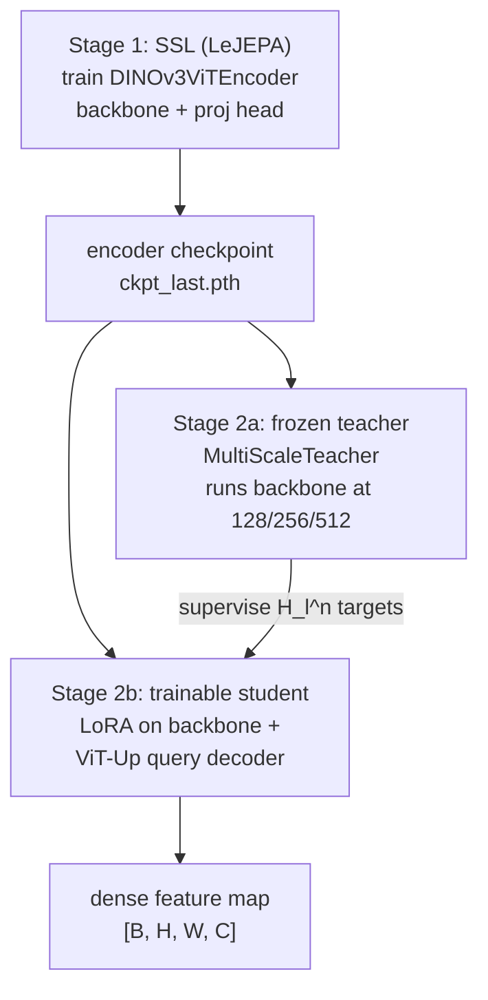

# FAQ — tomojepa design choices

Answers to common questions about how **tomojepa** handles data, training,
SIGReg, ViT-Up upsampling, and domain-specific augmentations for microCT
tomography. For architecture diagrams and file maps see [`ARCHITECTURE.md`](../ARCHITECTURE.md);
for install and CLI usage see [`README.md`](../README.md).

---

## 1. Did you patchify images for training/inference, or augment the entire image?

**Short answer:** We do **not** pre-tile volumes into a patch dataset. We train on
**full 2D tomography slices** and apply **multi-view augmentations** (random crops,
flips, domain noise, etc.) on each slice. The ViT **patchifies internally**
(patch size 16). At eval/inference we use a deterministic **resize + center crop**
of the whole slice.

### What actually happens in the data pipeline

[`TomographyDataset`](../src/tomojepa/core/dataset.py) lazily indexes a directory
of 3-D volumes (HDF5 or Zarr). Each training sample is one depth-slice from one
volume — not a pre-extracted patch from a sliding window.

In **train mode**, `__getitem__` returns a stacked tensor of augmented views of
the **same slice**:

```
views = [global_tf(img) × global_views] + [local_tf(img) × local_views]
return torch.stack(views)   # shape [V, C, H, W]
```

Default view counts are 2 global + 2 local = 4 views per slice. LeJEPA's
invariance term compares these views, so they must come from the same underlying
slice.

In **eval mode**, a single deterministic view is returned via `test_tf` (no random
crops, no noise).

### Training vs. inference preprocessing

| Stage | Pipeline | Purpose |
|-------|----------|---------|
| **SSL training** | `CustomIntensityWindowing` → `RandomResizedCrop(img_size)` → flips/rotation/noise → `Normalize(0.5, 0.5)` | Stochastic multi-scale views for invariance learning |
| **SSL validation / patchdb encoding** | intensity windowing → `Resize(img_size)` → `CenterCrop(img_size)` → normalize | Reproducible, full-field view of the slice |
| **ViT-Up training** | same eval-style loader at `img_size` (typically 512); student canvas is built inside the distillation engine | Teacher sees full resized slices at multiple resolutions |
| **ViT-Up inference** | eval transform at target resolution, then dense query grid via `upsample()` | High-resolution feature map over the whole slice |

The key distinction from "patchification" is:

- **Input level:** we never chop a slice into non-overlapping tiles and treat each
  tile as an independent training example.
- **Model level:** the ViT backbone divides the (cropped/resized) image into a
  `grid × grid` token lattice (`grid = img_size / 16`). All downstream token
  operations (MIM masking, foreground detection, patch retrieval) work on this
  internal grid.
- **Augmentation level:** `RandomResizedCrop` *does* zoom into sub-regions of the
  slice during training — but that is a **stochastic view** of the full slice, not
  a fixed patch dataset.

### Global vs. local views (multi-scale without patch datasets)

The only difference between "global" and "local" augment pipelines is the
`RandomResizedCrop` **area scale band** ([`augmentations.py`](../src/tomojepa/core/augmentations.py)):

| View tier | Default scale band | Typical content |
|-----------|-------------------|-----------------|
| Global | `(0.4, 1.0)` | Wide-area context — most of the sample holder + surrounding structure |
| Local | `(0.1, 0.4)` | Aggressive zoom — individual grains, pores, or texture patches |

Both tiers render to the same `img_size` (default 512, or 1024 in some ViT-Up
runs) so views stack into a single tensor. This gives the SSL objective both
scene-level and part-level invariance without maintaining separate patch and
full-image dataloaders.

Typical runs on soil data used tighter crops, e.g. global/local both at
`(0.7, 1.0)` when the sample already fills most of the field of view.

### Where patches *do* appear downstream

**Patch retrieval (`patchdb`)** operates on the encoder's **patch tokens** —
L2-normalized backbone features on the `G × G` grid — but that is an indexing
choice for cross-image similarity search, not how SSL training is fed. See
[`patchdb/README.md`](../src/tomojepa/patchdb/README.md).

**MIM / block masking** (when `--mim_weight > 0`) masks contiguous **token**
rectangles on the ViT grid (BEiT-style), not arbitrary pixel patches in the
input image. The mask is applied after `patch_embed`.

---

## 2. Did you encounter difficulties with training dynamics or SIGReg implementation?

Two separate topics: **implementing SIGReg correctly** (mostly engineering) and
**training dynamics** (mostly objective design).

### SIGReg — what it is

[`SIGReg`](../src/tomojepa/core/model.py) (Sketched Isotropic Gaussian
Regularizer) is LeJEPA's collapse-prevention term. It replaces the teacher/EMA
machinery of classic JEPA. Concretely:

1. Projected embeddings `proj` have shape `[V, N, D]` (views × batch × proj dim).
2. Draw `n_sketches=256` random unit-norm directions in ℝ^D.
3. Project embeddings onto each direction and compare the empirical characteristic
   function (cos/sin means over the N samples) to that of a standard isotropic
   Gaussian, integrated over a knot grid (`knots=17`, `t_max=3.0`) with
   trapezoidal quadrature.
4. Return the mean squared error.

The full SSL objective ([`lejepa_loss_terms`](../src/tomojepa/ssl/train.py)):

```
loss = λ · SIGReg(proj) + (1 − λ) · invariance(proj)
invariance = mean( (proj.mean(over views) − proj)² )
```

Default `λ = 0.02`, `proj_dim = 16`.

### SIGReg — implementation difficulties

The SIGReg forward pass itself is ~30 lines and stable. The **hard part** is that
SIGReg is a **distribution-level statistic over all N samples jointly** — you
cannot evaluate it independently per GPU rank or per microbatch and sum the
results. That breaks two common training patterns:

| Pattern | Why it fails with SIGReg |
|---------|--------------------------|
| **`DistributedDataParallel`** | Each rank computes SIGReg on its local shard; gradients do not match a true global-batch SIGReg |
| **Naive gradient accumulation** | Each microbatch's SIGReg sees only `batch_size` samples; accumulated gradients ≠ full-batch SIGReg gradient |

Our workarounds ([`core/dist.py`](../src/tomojepa/core/dist.py), [`ssl/train.py`](../src/tomojepa/ssl/train.py)):

1. **No DDP.** Manual distributed primitives instead.
2. **`all_gather_cat(proj, dim=1)`** — differentiable all-gather that concatenates
   every rank's projections before SIGReg. Backward scatters only this rank's slice
   of the gradient.
3. **`sync_rng(seed)`** — identical CPU+CUDA RNG state across ranks right before
   SIGReg so random sketch directions `A` match on every GPU.
4. **`all_reduce_grads_` (SUM)** — reconstruct the exact full-batch parameter
   gradient after the local backward.
5. **GradCache** (when `--accum_steps > 1`) — two-pass backward:
   - *Pass 1 (no grad):* forward every microbatch, concatenate projections,
     gather across ranks, evaluate full-batch LeJEPA loss → cache `d(loss)/d(proj)`.
   - *Pass 2:* re-forward each microbatch with **restored RNG state** (so
     stochastic depth / mask draws match pass 1), backprop cached projection
     gradients. Per-sample MAE/decorr terms accumulate per microbatch.

Net result: **exact full-batch SIGReg gradients at single-microbatch memory**.
This is why `--accum_steps > 1` requires bf16 or fp32 (not fp16 + GradScaler).

Typical soil run config:

```
GradCache: 4 microbatches × batch_size 4 = effective batch 16 samples
           (64 views) for SIGReg, at 4-sample memory
```

Multi-GPU launch (same pattern):

```bash
torchrun --nproc_per_node=4 -m tomojepa.ssl.train \
    --data_dir /path/to/volumes --batch_size 8 --accum_steps 2
# effective SIGReg batch = 8 × 2 × 4 = 64 samples
```

### SIGReg — training dynamics (what we observed)

SIGReg values in logs start around **5–6** early in training and drift upward as
the projected distribution spreads — this is expected and not inherently a bug.
The more informative collapse monitors are the **label-free validation metrics**
in [`ssl/validate.py`](../src/tomojepa/ssl/validate.py):

| Metric | Meaning | Collapse signal |
|--------|---------|-----------------|
| `emb_effrank` | Effective rank of pooled backbone features across slices | **Low** → embeddings use few dimensions |
| `token_effrank` | Effective rank of within-image patch tokens | **Low** → spatial features homogenize |
| `aug_cos` | Cosine similarity of pooled features across two independent augs of the same slice | **→ 1.0** → extreme augmentation invariance |
| `aug_cos_std` | Spread of `aug_cos` across slices | High variance → inconsistent invariance |

Effective rank = exp(entropy(normalized singular values)) of the centered feature
matrix (Roy & Vetterli, 2007).

**Baseline LeJEPA** (`val_baseline`, pure invariance + SIGReg, no MIM) on a 1024-slice
synthetic volume over 15 epochs:

- `aug_cos` climbed from ~0.95 → **~0.9999** (near-perfect invariance)
- `token_effrank` fell from ~139 → **~27** (loss of spatial diversity)
- `emb_effrank` ended around **8–10** out of 384 dimensions

**Residual + MIM** (`val_residual`, `--mim_weight > 0 --residual_local`) on the
same volume:

- `emb_effrank` fell to **~2.7–3.5** by epoch 14 (stronger collapse signature on
  pooled features)
- `token_effrank` fell to **~7–11**
- `aug_cos` stayed lower (~0.93–0.96) — less trivial invariance, but at the cost
  of rank

These numbers are run-specific and should not be treated as universal, but they
illustrate the core dynamic tension: **pure invariance objectives tend toward
high `aug_cos` and can wash out spatial structure** unless complementary terms
(MIM, residual factorization, heavier augmentation) counteract the shortcut.

Other dynamics notes:

- **MIM cost:** with `--residual_local`, each view requires **2 backbone forwards**
  (full-image tokens `T` + masked context encode). Training is ~2× slower per step
  vs. pure LeJEPA.
- **λ trade-off:** default `λ=0.02` heavily weights invariance (98%) over SIGReg
  (2%). Raising λ spreads the projected distribution but can fight invariance.
- **Batch size matters for SIGReg:** too-small effective batches make the
  characteristic-function estimate noisy. We target ≥16 samples (often via
  GradCache) even when GPU memory limits per-step batch to 4.
- **Foreground masking** (`--foreground_mask`) prevents the flat sample holder /
  imaging frame from dominating MIM targets and residual pooling when the slice
  includes background.

For deeper discussion of shortcut learning and why MIM complements invariance,
see [`docs/NEXT_MODEL_DESIGN.md`](NEXT_MODEL_DESIGN.md).

---

## 3. How does super-resolution / upscaling in latent space work?

Your mental model is close: we **do** train an upsampling module on top of a
(frozen) encoder — but it is a **separate second stage** after SSL pre-training,
not a decoder trained jointly during JEPA. The implementation follows
[ViT-Up (arXiv:2606.14024)](https://arxiv.org/abs/2606.14024), adapted to our
grayscale DINOv3 backbone.

### Pipeline overview



Entry points: `tomojepa train-vitup` / `tomojepa infer-vitup`. See
[`vitup/`](../src/tomojepa/vitup/) and [`ARCHITECTURE.md` §4](../ARCHITECTURE.md#4-vit-up-subsystem-tomojepavitup).

### What is *not* happening

- We are **not** training a pixel decoder (no RGB reconstruction).
- We are **not** upsampling the input image — we upsample the **feature map** in
  backbone latent space.
- The SSL projection head is **discarded** at ViT-Up time; only `backbone.*`
  weights are loaded ([`load_backbone_state`](../src/tomojepa/vitup/backbone_adapter.py)).

### The ViT-Up model (query-based latent upsampler)

Given an image, ViT-Up computes a query-independent **`ImageContext`** once
(backbone hidden states + high-res patch-embed cache + pre-projected keys/values),
then evaluates **arbitrary continuous 2-D query coordinates** against it:

```
q₀ = QueryEmbedding(high_res_patch_embed_cache, x_q)
for t in 1..T:  q_t = U_t(q_{t−1}, x_q, H_{l[t]})    # refinement blocks
o_t = D_t(q_t)                                       # per-stage decoders
```

**Components** ([`vitup/model.py`](../src/tomojepa/vitup/model.py)):

| Module | Role |
|--------|------|
| **`QueryEmbedding`** | Re-runs the backbone patch-embed conv at a **higher** resolution (`query_embed_grid=224` tokens/side), caches the grid, bilinearly samples at each query coordinate → initial query feature `q₀` |
| **`ViTUpBlock` `U_t`** | Four fused parts: (1) transition MLP aligning to layer `l[t]`'s feature space; (2) **cross-window attention** with continuous 2-D RoPE — each query attends only to backbone tokens in a `window×window` neighborhood (default 7); (3) **FeatX** — FiLM-modulated nearest-token feature + sub-token offset encoding to recover high-frequency detail windowed attention blurs; (4) fusion MLP |
| **`StageDecoders` `D_t`** | Separate output projection per stage `t = 0..T`, mapping latent queries back to ViT feature space (dim `C=384`). All stages are supervised |

**Chunked querying:** queries are conditionally independent given the image
context, so `query()` splits coordinates into chunks of `query_chunk_size`
(default 4096) and concatenates — exact same result as an unchunked pass, but
memory-bounded. `upsample(img, H, W)` builds a dense output grid → `[B, H, W, C]`.

Default architecture: `T=6` blocks, backbone layers `{2, 4, 6, 8, 10, 12}`,
`internal_dim=384`, `attention_window=7`.

### Distillation training (what gets optimized)

A **frozen multi-scale teacher** supervises a **LoRA-adapted student** +
ViT-Up ([`vitup/distill.py`](../src/tomojepa/vitup/distill.py)):

1. **Teacher** (frozen SSL backbone): run the input image at several square
   resolutions. Defaults: `(128, 256, 512)` → token grids `(8, 16, 32)` at
   patch size 16. Extract hidden states `H_l^n` at every supervised layer and
   grid `n`.

2. **Student input:** downscale the image by `s ~ U(s_min, s_max)` (default
   `(0.1, 1.0)`), random-paste into a black `student_canvas` (default 512, or
   1024 in high-res runs). Sample a regular `query_grid × query_grid` coordinate
   grid over the pasted region.

3. **Student forward:** ViT-Up predicts `o_t` at every stage for every query
   coordinate.

4. **Loss** ([`vitup/losses.py`](../src/tomojepa/vitup/losses.py)): each
   prediction is average-pooled from the finest query grid down to each teacher
   grid `n`, then compared with three terms (weighted equally by default):
   - **Target-normalized L2** (normalized by the teacher's per-vector std)
   - **Cosine** (`1 − cos`)
   - **Relational KL** — preserves pairwise similarity structure across an
     image's N features (diagonal masked, temperature `τ=0.1`)

**LoRA** ([`backbone_adapter.py`](../src/tomojepa/vitup/backbone_adapter.py)):
rank `r=16`, alpha `32`, dropout `0.05`, applied to `patch_embed`, `attn.qkv`,
`attn.proj`. Everything else frozen. Typical trainable count: **~23M params**
(LoRA + ViT-Up) vs. frozen teacher.

Example soil run (`vitup_soil_1024_5ep`):

```
Dataset: 1026 slices, 1 volume
Teacher resolutions [256, 512, 1024] → grids [16, 32, 64]
query_grid=64, student_canvas=1024, chunk=2048
Trainable params: 22.94M (LoRA r=16 + ViT-Up T=6, D=384)
```

At inference, a 1024×1024 slice yields a **64×64** dense feature map (4096
tokens) instead of the backbone's native **32×32** at 512px — a 2× spatial
upsampling of the latent grid, with sub-token precision via continuous query
coordinates and FeatX.

### Why a separate stage?

1. SSL optimizes **global invariance** across augmented views — the right objective
   for a general encoder, but not for dense spatial fidelity.
2. ViT-Up optimizes **faithful local feature reproduction** at arbitrary
   resolution — complementary, and expensive enough to warrant its own training
   loop.
3. Keeping stages separate lets downstream tools (`patchdb`, segmentation probes)
   use the SSL checkpoint directly without requiring ViT-Up.

---

## 4. Was training/validation data mainly tomo slices from the same experiment?

### What we trained on (so far)

Most runs to date use **slices from a single 3-D volume per experiment**, not a
multi-study corpus:

| Run | Slices | Volumes | Notes |
|-----|--------|---------|-------|
| `soil_residual_fg` | 1026 | 1 (`soild_stack.zarr`) | Primary real-data SSL run with MIM + residual + foreground mask |
| `vitup_soil_1024_5ep` | 1026 | 1 | ViT-Up distillation from soil SSL ckpt, 1024px canvas |
| `mystack_residual_fg` | 79 | 1 | Smaller dev/debug stack |
| `val_baseline` / `val_residual` | 1024 | 1 (`upsampled_1024.zarr`) | Controlled A/B on synthetic data |
| `ms5k` | 1024 | 1 | Synthetic baseline |

There is **no rigorous cross-experiment holdout** yet. Slices from the same volume
are treated as i.i.d. training samples; adjacent slices are highly correlated
(standard tomography caveat).

### How we validate without labels

[`tomojepa validate`](../src/tomojepa/ssl/validate.py) computes **intrinsic**
metrics on the **backbone** (not the projection head), so different objective
variants are directly comparable:

- Fixed subset of slice indices (default: evenly spaced across the volume)
- Two independent global augmentations per slice → measure invariance
- No train/val split in the supervised sense — it is a checkpoint quality probe
  on held-out slices from the **same volume**

For ViT-Up, progress is monitored via periodic **PCA probes** on fixed slices
(e.g. 653 and 871 in the soil run) written to `out/pca/`.

### Do we expect to use the encoder beyond similarity?

**Yes — similarity/retrieval is the most mature path, but not the only one.**

| Downstream use | Status | How |
|----------------|--------|-----|
| **Cross-image patch retrieval** | Implemented | [`patchdb`](../src/tomojepa/patchdb/): shared PCA basis over foreground patch tokens, FAISS candidate generation, exact integral-image re-rank at arbitrary window sizes |
| **Dense feature visualization** | Implemented | ViT-Up PCA maps (`infer-vitup`), cascade RGB from encoder eigenmodes (`viz cascade-rgb`) |
| **Shape / morphology probing** | Implemented | Thresholded instance segmentation + eccentricity analysis (`viz analyze-shapes`) — uses raw intensity, not the encoder, but lives in the same analysis pipeline |
| **Segmentation** | Planned / compatible | Checkpoints preserve the exact `DINOv3ViTEncoder` architecture (`num_classes=embed_dim`) so weights load into an evaluation notebook (`evaluate_lejepa_segmentation.ipynb`). SSL was **not** trained with segmentation labels; any segmentation use would be linear probe or fine-tune on top of frozen/partially unfrozen features |
| **Cross-experiment generalization** | Not yet tested | Would require training or at least evaluating on multiple scans / sample types |

The encoder was designed as a **general microCT representation** — grayscale,
reconstruction-agnostic intensity windowing, domain augmentations for dose/blur
variation — but empirical generalization beyond the training volume has not been
benchmarked.

---

## 5. What domain-specific augmentations did you use?

Generic ImageNet augmentations (color jitter, solarize, etc.) are absent. The
pipelines in [`core/augmentations.py`](../src/tomojepa/core/augmentations.py) are
built for **single-channel microCT reconstructions**.

Select at runtime with `--augment {tomo, tomo2}` (default: **`tomo2`**).

### Pipeline comparison

| Stage | `tomo` | `tomo2` (default) |
|-------|--------|-------------------|
| Pre: intensity windowing | ✓ | ✓ |
| `RandomResizedCrop` (scale band) | ✓ | ✓ |
| `RandomHorizontalFlip` / `RandomVerticalFlip` (p=0.5) | ✓ | ✓ |
| `RandomRotation(0–180°)` | — | ✓ |
| `RandomFloatEqualize` (p=0.5) | — | ✓ |
| `GaussianBlur` (p=0.5) | ✓ | ✓ |
| `PoissonNoise` (p=0.5) | ✓ | ✓ |
| `RandomPixelMask` (p=0.5) | ✓ | ✓ |
| `Normalize(mean=0.5, std=0.5)` | ✓ | ✓ |

### Custom transforms (the domain-specific ones)

#### `CustomIntensityWindowing` — always first

Clips each slice to its `[p_low, p_high]` = `[0.01, 0.99]` intensity quantiles,
then linearly normalizes to `[0, 1]`. Quantiles are estimated on a random 100k-pixel
subsample for speed on large slices. `NaN`s are zeroed; a degenerate window
(`q_high ≤ q_low`) yields a zero image.

**Why:** microCT reconstructions arrive with wildly different absolute intensity
scales (different setups, filters, phase-contrast vs. absorption, etc.). This
step is reconstruction-agnostic contrast normalization that makes diverse volumes
comparable without requiring per-dataset calibration.

#### `PoissonNoise(scale=10000)` — p=0.5

Simulates **photon shot noise**: scale the normalized image to photon counts,
draw `torch.poisson`, scale back, clamp to `[0, 1]`.

**Why:** encodes invariance to dose / exposure / counting statistics — a primary
source of appearance variation in real tomography data.

#### `RandomPixelMask(mask_ratio=0.15)` — p=0.5

Bernoulli pixel dropout: ~15% of pixels zeroed independently.

**Why:** input-level denoising / robustness signal. Distinct from the **token-level**
MIM masking in SSL (which operates on the ViT patch grid after `patch_embed`).

#### `RandomFloatEqualize(p=0.5)` — `tomo2` only

Histogram-equalizes the float image by round-tripping through `uint8` and
`v2.RandomEqualize`.

**Why:** decorrelates learned features from the global intensity histogram shape
— prevents the encoder from leaning on absolute gray-level distribution as a
cheap shortcut.

#### `GaussianBlur(kernel_size=7, sigma=(0.1, 1.0))` — p=0.5

**Why:** simulates PSF blur / effective resolution variation between scans or
reconstruction settings.

#### Multi-scale `RandomResizedCrop`

Not a custom class, but domain-motivated: microCT structure is inherently
**multi-scale** (pores, grains, layering). The global/local view split (§1) is
the main scale augmentation.

#### `RandomRotation(0–180°)` — `tomo2` only

**Why:** sample orientation in the scanner is often arbitrary; full half-turn
rotation invariance is safe for unordered granular/porous media (not used when
directional structure matters).

### Augmentations outside the torchvision pipeline

These are applied during **MIM / residual training**, not in `augmentations.py`:

| Mechanism | Flag | Purpose |
|-----------|------|---------|
| **Block token masking** | `--mask_ratio 0.5 --mask_blocks 4` | BEiT-style contiguous rectangular masks on the ViT token grid; forces long-range context prediction |
| **Foreground token masking** | `--foreground_mask --fg_std_thresh 0.05` | Excludes flat sample-holder / imaging-frame patches (near-zero per-patch intensity std) from MIM targets and residual pooling |

Foreground detection ([`foreground_tokens`](../src/tomojepa/core/model.py)): the
sample sits on a flat surround; background patches have ≈0 intensity std while
textured sample patches have high std. Falls back to all-foreground for
fully-interior crops or all-background edge cases.

### Test / inference transform (no augmentation)

Deterministic pipeline used for validation, patchdb encoding, and ViT-Up teacher
forwards:

```
CustomIntensityWindowing → Resize(img_size) → CenterCrop(img_size) → Normalize(0.5, 0.5)
```

No crop jitter, no noise, no flips.

---

## 6. How does the residual MIM formulation work, and how should I set the weights?

This is the most involved optional extension to the base LeJEPA objective. It adds
**masked latent prediction (MIM)** and optionally **routes invariance through a
residual** so the encoder learns complementary "smooth context" and
"augmentation-invariant detail" bands. Implementation lives in
[`ssl/train.py`](../src/tomojepa/ssl/train.py) and
[`core/model.py`](../src/tomojepa/core/model.py); conceptual background in
[`RUN_LOCAL.md`](RUN_LOCAL.md) and [`NEXT_MODEL_DESIGN.md`](NEXT_MODEL_DESIGN.md).

### The problem it tries to solve

Pure LeJEPA (invariance + SIGReg) has a **shortcut**: two augmented views agree as
soon as the encoder throws away everything except a cheap local texture/intensity
descriptor. Once that works, there is **no gradient pressure** to build
long-range or structurally rich features ([`NEXT_MODEL_DESIGN.md` §3](NEXT_MODEL_DESIGN.md)).

MIM (predict masked patch tokens from visible context) is **predictive** rather
than merely invariant — it forces the model to carry information across occluded
regions. But MIM has its own shortcut: small scattered masks are solved by
near-neighbor interpolation. **Block masks** (contiguous rectangles covering
~50% of tokens) push the model toward genuine long-range context.

The **residual factorization** asks: instead of making the *entire* representation
invariant, can we split it into a **smooth, interpolatable context** `C` (trained
by MIM) and an **augmentation-invariant residual** `R` (trained by LeJEPA)?

### Two modes: additive vs. residual

Controlled by whether you pass `--residual_local`:

| Mode | Flags | LeJEPA applied to | Total loss |
|------|-------|-------------------|------------|
| **Pure LeJEPA** | (defaults) | `proj(pooled backbone emb)` | `lejepa(proj)` |
| **Additive MIM** | `--mim_weight W` | `proj(pooled emb)` — unchanged | `lejepa(proj) + W · mae` |
| **Residual MIM** | `--mim_weight W --residual_local` | `proj(mean(R))` where `R = T − stopgrad(C)` | `lejepa(proj(R)) + W · mae + W_indep · decorr` |

**Recommendation:** if you enable MIM at all for tomography, use **`--residual_local`**
unless you are explicitly ablating. Additive MIM leaves LeJEPA on the raw tokens,
so invariance and reconstruction compete on the same representation rather than
occupying complementary bands.

### The forward pass (residual mode)

For each augmented view, [`residual_view`](../src/tomojepa/core/model.py) computes:

```
T  = backbone.forward_features(view)           # full-image patch tokens [B, P, D], with grad
ctx = encode_masked(view, block_mask)          # masked encode (2nd backbone forward)
C  = MaskedLatentPredictor(ctx)                # smooth latent field [B, P, D]
tgt = LayerNorm(T).detach()                    # stop-grad MAE target (optional, on by default)

mae = SmoothL1(C[masked], tgt[masked])        # only at masked positions
R   = T − C.detach()                           # residual tokens
z_local = proj(mean_pool(R, foreground))       # pooled residual → proj head
```

LeJEPA (invariance + SIGReg) then runs on `z_local` stacked across views —
shape `[V, N, proj_dim]` — exactly like the baseline, but the invariant quantity
is the **residual**, not the raw patch tokens.

Key design choices baked into the code:

- **`MaskedLatentPredictor` is a separate module** from `DINOv3ViTEncoder`, so the
  encoder `state_dict()` stays compatible with downstream tools and the eval
  notebook. Only `mim.*` weights are extra in the checkpoint.
- **`C` is predicted at all patch positions**, not just masked ones — it is a
  smooth *field* over the grid. MAE loss is evaluated only where the block mask
  is True.
- **`C.detach()` in the residual** prevents LeJEPA from trivially pushing `C` to
  zero to simplify invariance. The context band is owned by the MAE term.
- **Block masking** ([`make_block_mask`](../src/tomojepa/ssl/train.py)): up to
  `--mask_blocks` (default 4) random rectangles until `--mask_ratio` (default 0.5)
  of the `grid×grid` token lattice is covered. On a 512px / patch-16 model that
  is a 32×32 = 1024 token grid.

With `--foreground_mask`, MAE targets and residual pooling restrict to **foreground
tokens** (sample ROI detected by per-patch intensity std > `--fg_std_thresh`,
default 0.05). This matters when the slice includes a flat imaging frame or
holder surround.

### All relevant flags

| Flag | Default | Role |
|------|---------|------|
| `--mim_weight W` | `0` (off) | Weight on the MAE (smooth-L1) term. Must be > 0 for any MIM. |
| `--residual_local` | off | Route LeJEPA through `proj(mean(R))` instead of `proj(emb)`. Requires `--mim_weight > 0`. |
| `--indep_weight W` | `0` (off) | Optional squared Frobenius norm of the cross-covariance between `z_local` and pooled `C` ([`decorr`](../src/tomojepa/core/model.py)). Requires `--residual_local`. |
| `--mask_ratio` | `0.5` | Fraction of patch tokens masked per view. |
| `--mask_blocks` | `4` | Number of rectangular blocks laid down per sample. Increase (or mask ratio) if your data's correlation length is large — masks must exceed local interpolation range. |
| `--foreground_mask` | off | Restrict MAE + residual pooling to foreground tokens. Recommended for soil/plant scans with holder background. |
| `--fg_std_thresh` | `0.05` | Per-patch std threshold for foreground (in normalized view units). |
| `--no_mim_target_norm` | norm on | Disable LayerNorm on the stop-grad MAE target `T`. Default is on. |

Constraints enforced at startup:

```python
--residual_local  requires  --mim_weight > 0
--indep_weight > 0  requires  --residual_local
```

### How to set `--mim_weight` (and `--indep_weight`)

There is no single universally optimal value — the right weight depends on how
large `mae` is relative to `lejepa` **at your batch size and data**. The training
log prints both every `--log_every` steps (unweighted):

```
lejepa=0.135, mae=0.343, sigreg=5.997
```

where `lejepa = λ·SIGReg + (1−λ)·invariance` with default `λ=0.02`.

**Total loss** (residual mode):

```
loss = lejepa(proj(R)) + mim_weight · mae + indep_weight · decorr
```

#### Practical tuning guide

1. **Start with `mim_weight = 1.0`.** In our runs, raw `mae` and raw `lejepa`
   are typically the same order of magnitude (~0.1–0.4 early, ~0.15–0.25 late).
   A weight of 1.0 gives MIM comparable influence to the LeJEPA term and is the
   recommended starting point. We have **not** run a systematic sweep over
   `{0.1, 0.5, 1, 2, 5}` — treat 1.0 as a scale-matched default, not a tuned optimum.

2. **Watch the MAE curve.** `mae` should decrease over training (0.44 → ~0.18
   over epoch 0 in typical runs). If `mae` stalls high while `lejepa` collapses,
   try raising `mim_weight` to 2–5. If features look over-smoothed (eigenmaps
   dominated by a single low-frequency component), lower it to 0.1–0.5.

3. **Do not confuse logged `lejepa` with total loss.** The progress bar does
   *not* include `mim_weight · mae`. Multiply mentally when judging balance.

4. **`indep_weight`:** start at **`0.01`** when using `--residual_local`. This
   is small relative to the other terms — it nudges `z_local` and pooled `C`
   toward linear independence without dominating. Our soil and synthetic A/B runs
   used `indep_weight=0.01`. Set to `0` to disable if you see instability; raise
   to `0.05–0.1` only if PCA/eigenmaps show context and residual bands collapsing
   onto the same directions.

5. **Compute budget:** residual mode costs **2 backbone forwards per view**
   (full `T` + masked context). With 4 views/sample and GradCache, expect ~2×
   wall time vs. pure LeJEPA. Reduce `--local_views` or `--accum_steps` if needed,
   but keep effective SIGReg batch ≥ 16.

6. **Mask sizing:** if your material's spatial correlation length is ~N patches,
   block masks should cover **> N tokens** in at least one dimension. For soil
   (grain-scale correlation), defaults (`mask_ratio=0.5`, 4 blocks on 32×32) are
   reasonable. For synthetic white-noise-like volumes (no long-range order), MIM
   cannot learn meaningful context — see evidence below.

#### Example commands

```bash
# Residual MIM on real soil data (our primary recipe)
tomojepa train-ssl \
    --data_dir . --pattern 'soild_stack.zarr' --backend zarr \
    --mim_weight 1.0 --residual_local \
    --indep_weight 0.01 --foreground_mask \
    --mask_ratio 0.5 --mask_blocks 4 \
    --batch_size 4 --accum_steps 4   # GradCache: effective batch 16 for SIGReg

# Pure LeJEPA baseline (for A/B)
tomojepa train-ssl \
    --data_dir . --pattern 'upsampled_1024.zarr' --backend zarr \
    --batch_size 4 --accum_steps 4
# (no --mim_weight)

# Additive MIM ablation (not recommended as default)
tomojepa train-ssl ... --mim_weight 1.0
# (no --residual_local)
```

### What evidence we have

Evidence is **mixed** — residual MIM clearly changes the representation geometry,
but we do **not** yet have a downstream task where it decisively beats baseline
LeJEPA on real soil data.

#### 1. Controlled A/B on synthetic data (`val_baseline` vs `val_residual`)

Both runs: same volume (`upsampled_1024.zarr`, 1024 slices), same backbone, 15
epochs, GradCache effective batch 16. The only difference is MIM + residual +
`indep_weight=0.01`.

**Final metrics (epoch 14)** from [`validate.py`](../src/tomojepa/ssl/validate.py)
(`runs/*/metrics.json`):

| Metric | Baseline LeJEPA | Residual MIM | Interpretation |
|--------|-----------------|--------------|----------------|
| `emb_effrank` | 8.2 | **2.9** | Residual concentrates pooled embedding variance into far fewer effective dimensions (~3× drop) |
| `token_effrank` | 27.1 | **9.0** | Within-image patch diversity also drops sharply |
| `aug_cos` | **0.9999** | 0.935 | Baseline achieves near-trivial augmentation invariance on raw tokens `T`; residual resists this on `R` |

Reproduce the comparison plot:

```bash
python -m tomojepa.viz.build_comparison \
    --baseline val_baseline --residual val_residual \
    --out runs/ab_comparison.png
```

The script ([`viz/build_comparison.py`](../src/tomojepa/viz/build_comparison.py))
summarizes takeaways:

- Residual **concentrates variance hard** (~3× lower effective rank, consistent
  with a PCA spectrum where the top few components explain most variance).
- **`aug_cos` on `T` is misleading for residual runs** — validation computes
  cosine similarity on **raw backbone tokens**, but LeJEPA invariance is trained
  on **`R = T − C`**, not `T`. Lower `aug_cos` for residual does *not* mean the
  invariant band failed; it may mean `C` absorbs the shared augmentation signal.
- We do **not yet log `aug_cos(R)`** — adding that metric is an open todo for
  fair residual evaluation.

#### 2. Eccentricity / material probe (synthetic balls & eggs)

[`viz/probe_shapes.py`](../src/tomojepa/viz/probe_shapes.py) segments objects in
synthetic slices, pools patch tokens per object, and linearly decodes eccentricity
and ball-vs-egg material class (5-seed CV):

| Probe | Baseline | Residual | Notes |
|-------|----------|----------|-------|
| Ball/egg AUC | ~0.99 | ~0.99 | Both near-perfect (density cue is strong) |
| Eccentricity R² (eggs only) | 0.30 ± 0.05 | 0.23 ± 0.05 | Overlapping confidence intervals — **no robust shape gap** |

Both encoders carry real shape information beyond raw density, but residual MIM
does **not** reliably improve eccentricity decoding on this synthetic benchmark.

#### 3. PCA / eigenmaps (qualitative)

[`validate.py --eigen_grid`](../src/tomojepa/ssl/validate.py) and training-time
PCA visualizations (`outputs/pca_step*.png`, `runs/soil_residual_fg/out/eigen_grid_*.png`)
show that residual checkpoints tend to produce **fewer dominant eigenmodes** —
spatial maps where PC1–PC3 explain most of the token variance. This matches the
effective-rank numbers and is visible qualitatively when comparing
`eigen_grid_ep14_slice774.png` across runs.

On **real soil data** (`soil_residual_fg`, 1026 slices, `--foreground_mask`), the
residual checkpoint at epoch 14 was chosen as the **teacher for ViT-Up**
(`vitup_soil_1024_5ep`) based on visual PCA quality and downstream usability —
this is engineering preference, not a formal benchmark win.

#### 4. What the synthetic gate tells us

[`NEXT_MODEL_DESIGN.md` §4](NEXT_MODEL_DESIGN.md) notes that `upsampled_1024.zarr`
is **synthetic with no long-range order** — it fails the long-range dependence
gate by construction. On that volume, residual MIM mainly lets us debug the
*machinery* (GradCache + MIM + residual routing), not measure long-range benefit.
**Real plant/soil data** has genuine multiscale hierarchy; that is where MIM's
block-context pressure is theoretically motivated.

#### 5. What we do *not* have yet

- No cross-volume generalization study (all runs are single-volume).
- No labeled segmentation benchmark comparing baseline vs. residual.
- No systematic `mim_weight` sweep (0.1 / 0.5 / 1 / 5) with held-out metrics.
- No `aug_cos(R)` or per-band ablation in validation.
- No comparison of additive vs. residual MIM at matched compute.

### Current recommendation

| Goal | Suggested config |
|------|------------------|
| **Fast baseline / retrieval** | Pure LeJEPA (`mim_weight=0`). Cheaper, higher `token_effrank`, good enough for `patchdb` similarity. |
| **Structured / factorized features** | `--mim_weight 1.0 --residual_local --indep_weight 0.01 --foreground_mask` on real scans with background. |
| **Debugging MIM plumbing** | Same flags on synthetic data; compare `mae` curve and eigenmaps, not downstream task gains. |
| **Evaluating fairly** | Run `validate.py` on both runs *and* inspect eigenmaps; interpret `aug_cos` cautiously for residual; use `probe_shapes` or a labeled task for downstream signal. |

The residual formulation is best understood as a **research direction** (splitting
context from invariant detail) with solid implementation and clear geometric
effects, not as a proven upgrade over baseline LeJEPA on every metric we have
measured so far.

---

## Related docs

- [`ARCHITECTURE.md`](../ARCHITECTURE.md) — full system design, file map, data flow
- [`RUN_LOCAL.md`](RUN_LOCAL.md) — local training flags, MIM/residual modes, DGX Spark notes
- [`NEXT_MODEL_DESIGN.md`](NEXT_MODEL_DESIGN.md) — range/scale factorization design draft
- [`patchdb/README.md`](../src/tomojepa/patchdb/README.md) — patch retrieval engine
