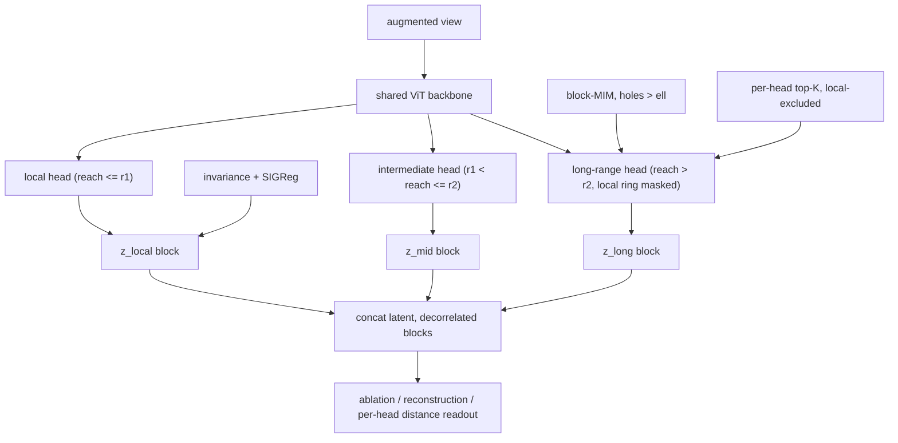

# Next-model design: range/scale-factorized SSL for microCT

Status: design draft (2026-06-15). Actionable plan for tomorrow. Builds on the
existing residual-MIM implementation (`main.py`, `model.py`, `validate.py`).

## 1. Goal

A latent space where **different sections are attributable to different
range/scale-like features** -- a readable factorization into bands (e.g. local
texture vs. intermediate structure vs. long-range layout), rather than one
entangled vector. Secondary goal: actually *build* long-range structure, which
pure invariance objectives will not learn on their own (see Section 3).

## 2. Two axes -- do NOT conflate them

| Axis | What it controls | Knob | Bottleneck type |
|------|------------------|------|-----------------|
| **Resolution / scale** | feature *granularity* (coarse vs fine detail) | patch size / input downsampling | hard (a patch32 token cannot represent sub-32px detail) |
| **Range / reach** | *how far* a token can be informed from | attention distance (banded heads) | soft/structural |

They **correlate** (a head aggregating over a large area averages out detail ->
smoother/coarser output) but are **not identical**. Range-banded heads + top-K
selection can capture *fine-grained long-range* dependencies (a sharp distant
correspondence), which is **strictly richer** than a coarse resolution pyramid.

Practical implication: get true resolution bands from **patch size**; get range
bands from **attention reach**. Treat them as separate knobs.

## 3. The core obstacle: shortcut learning

An invariance loss (LeJEPA) is satisfied the instant two views agree, so SGD
finds the **lowest-complexity sufficient statistic** -- almost always a *local*
descriptor (texture/intensity). Once the cheap local solution works there is
**zero gradient pressure** to build anything long-range. You cannot "encourage"
long-range; you must **block the local shortcut**:

- information removal (large masks / occlusion),
- make the local cue unreliable (heavy appearance aug),
- predict across a gap, or
- architectural bottleneck (a head that *cannot* see local).

**MIM complements invariance** because it is *predictive* (reconstruct hidden
from visible) -> an explicit bottleneck with no local escape hatch. This is the
DINO+iBOT / DINOv2 recipe. BUT MIM has its **own** shortcut: small/scattered
masks are solved by near-neighbor interpolation. Forcing long-range requires
**contiguous block masks larger than the data's correlation length** (Section 4).

Synthesis: invariance alone -> all local; + block-MIM -> long-range forced into
the context band; residual -> sorts the local leftover. The factorization does
not *create* long-range features, it *sorts* the ones MIM was forced to build.

## 4. Step 0 GATE (do this FIRST -- CPU only, no GPU)

Before any architecture work, verify long-range dependence *exists* in the data.
If microCT slices are locally correlated but globally near-independent, no
non-local puzzle is solvable and the long-context pursuit is a dead end (we then
refocus purely on resolution/scale bands).

Deliverable: a probe script on `upsampled_1024.zarr` that reports

- **spatial autocorrelation / structure function** -> correlation length `ell`
  (distance where correlation hits the noise floor),
- **long-range mutual information / dependence decay** beyond `ell`,
- whether global gradients / layering / large connected structures exist.

Outputs that feed the design: the value of `ell` sets the **mask block size**
(must exceed `ell`) and the **local-exclusion radius** for banded heads.

Gate decision:
- dependence persists well past a few grains -> proceed with long-range design.
- white past ~2 grains -> drop long-range, keep only the resolution/scale bands.

**Known going in:** the current `upsampled_1024.zarr` is **synthetic with no
long-range order** -> it will FAIL this gate, by construction. All long-range work
(banded long head, block-MIM > `ell`, landmark PE in Section 8) is therefore gated
on the **real plant data** (which has genuine complex multiscale hierarchy). On the
synthetic set, only the resolution/scale-band work (Phase 2) is meaningful; use it
to debug the *machinery*, not to measure long-range benefit.

## 5. Converged architecture

Single backbone, **distance-banded attention heads**, each feeding a
**decorrelated latent block**; block-MIM drives the long head, invariance drives
the local head; per-head top-K gives a readable dependency graph; patch size is a
separate, orthogonal resolution knob.

Key properties:
- **Structural enforcement**: the long head's local ring is masked -> it cannot
  take the local shortcut -> it builds long-range features or contributes nothing.
- **Attribution by construction**: per-head output blocks + per-head attention
  maps are directly readable. The "scale/range section of latent" is a head.
- **Measurable long-context usage**: average selected-predictor distance of the
  long head is a single scalar for "how long is the context actually used".

## 6. Incremental build plan (each phase independently testable)

**Phase 0 -- Step-0 probe (gate).** Section 4. CPU only. ~1 file. BLOCKS
everything long-range; do first.

**Phase 1 -- finish current residual-MIM A/B.** Already running tonight
(`runs/val_baseline` vs `runs/val_residual`). Run `validate.py` on both, compare
effective rank / aug-consistency / PCA. Establishes whether the 1-level residual
already helps before adding complexity.

**Phase 2 -- expose 2 bands (minimal change).** Pool both `C` (smooth context)
and `R = T - sg(C)` and concatenate as two **decorrelated** latent blocks (today
only `R` is used). Supervise each (LeJEPA on each) + keep `decorr`. This is the
cheap 2-band scale factorization and a small diff to `main.py`/`model.py`.
Verify: ablation (zero a block) + reconstruction (coarse vs +fine) + decorr value.

**Phase 3 -- distance-banded heads (soft first).** Add per-head relative-position
distance bias (ALiBi/T5-style) with different per-head slopes so heads
self-organize by range; group heads into local/intermediate/long and route each
group to its latent block. Soft + differentiable, no coverage gaps. Add a
diversity reg so heads do not collapse into one band.
Verify: per-head attention distance histograms separate by band.

**Phase 4 -- per-head top-K, local-excluded (for the long head).** Restrict the
long head's candidate keys to distance > `ell` and select top-K (soft-topk /
Gumbel / entropy-sparsified). Read out the selected-predictor graph.
Verify: mean selected distance > `ell`; dependency-graph visualization.

**Phase 5 -- block-MIM tuned by Step 0.** Set MIM block size > `ell`
(`--mask_blocks` / a new block-size arg). Confirm the long head is what predicts
large masked blocks (ablate the long head -> MIM loss jumps).

**Phase 6 -- landmark-anchored PE via nested Poisson inducing points (the bigger
bet, real data only).** Build a fixed multiresolution Poisson-disk hierarchy
(nested sets = scale levels + parent/child graph); soft-assign patches to nearby
points; feed point-relative coordinates to RoPE (extra rotary bands); hierarchical
message passing over the nested sets. Optional: modulate sampling density with an
importance map from the teed-off early blocks. Gated on real hierarchical data + a
favorable Step-0 on that data. See Section 8. Verify: that related-but-distant
structures become *near* in point-relative coordinates (long-range usage rises
without forcing), and stability of the hierarchy.

## 7. Verification / metrics (reuse + extend `validate.py`)

- effective rank **per block** (collapse detector, per band),
- augmentation-consistency per block,
- **cross-block decorrelation** (off-diagonal cross-covariance),
- **ablation probe**: zero a block -> which downstream behaviors degrade,
- **reconstruction**: decode from coarse block vs coarse+fine (pyramid check),
- **per-head selected-predictor mean distance** (long-context-usage scalar),
- **non-locality certificate**: for the MIM mask, min distance from each masked
  target to nearest visible patch > `ell`.

## 8. Landmark-anchored positional encoding (inducing points) -- the bigger bet

**The reframe.** A positional coordinate system is a modeling *choice*. Anchoring
it to detected structure turns long-range *pixel* dependencies into short-range
*graph* dependencies, so the model uses distant context **for free** instead of
being forced to. We do not make attention reach farther; we make related things
*near* in the right metric. This sidesteps the shortcut problem (Section 3) rather
than brute-forcing it.

**Constructing the inducing points: nested hierarchical Poisson sampling
(PREFERRED -- removes the hardest risk).**
Do **not** learn/detect landmarks (unstable: collapse, permutation,
chicken-and-egg). Instead use a **multiresolution Poisson-disk hierarchy**
`S0 subset S1 subset S2 ...`, each a blue-noise set at a finer min-distance `r`:
- **Nesting = the hierarchy + graph for free.** A fine point's parent is the
  coarse point it falls under -> the landmark graph and the scale levels both
  come for free; no detection, no clustering.
- **Bounded bridging falls out.** Each level's Poisson radius `r_L` *is* the
  bridging distance at that level (coarse `r` bridges the whole field, fine `r`
  bridges locally) -> the "bounded, not unconstrained" requirement is satisfied by
  the radius schedule.
- **Blue-noise coverage** -> well-conditioned sparse support, minimal Voronoi-seam
  pathology.
- **Stable cross-image identity.** A fixed nested scaffold means "the point at
  relative position x, level L" is the same in every image -> its relative
  geometry is a reusable feature (unlike *learned* landmarks, which lack stable
  identity). Lean **fixed scaffold + light jitter**.
- **Proven lineage:** this is PointNet++ / Point Transformer **set abstraction**
  (farthest-point sampling builds nested centroids + local grouping). Treat patch
  tokens as a point cloud, patch grid = finest level, Poisson sets = coarser
  levels; borrow their multi-scale recipes.
- **Optional content modulation:** importance-modulated Poisson samples denser
  where structure is. The density/importance map can come from the teed-off early
  blocks (below) -- geometric nesting gives the stable scaffold, early features
  bias *where* density goes. Robust, unlike discrete keypoint detection.

**Mechanism.**
- A small set of **inducing points** (landmarks) -- sparse-GP pseudo-inputs /
  Set-Transformer ISAB / Perceiver latents / Deformable-DETR reference points.
- Each patch gets a (soft) **landmark-relative coordinate**; RoPE is computed on
  that coordinate (or added as extra rotary bands alongside the grid RoPE). RoPE
  already encodes *relative* position, so feeding it landmark-relative coords makes
  attention a function of **structural relationship, not pixel offset**.
- Optional **landmark<->landmark graph** (message passing) carries the long-range /
  hierarchical mixing; **patch<->landmark** is the bipartite local attach. This is
  the "graph with approximate landmarks" -- the inducing-point view and the graph
  view are the same object.

**Bounded by design (NOT unconstrained).**
- `M` (landmark count) is **small** and tied to the expected hierarchy (a handful
  per scale level). This regularizes the problem and keeps cost at O(N*M).
- The **bridging distance is capped** at the relevant structural scale *per level*,
  not "anywhere in the image". We only bridge the gaps the hierarchy actually spans.
- **Multi-level**: a few coarse landmarks (organ) + more fine landmarks
  (tissue/cell) -> nested anchors = the scale bands (Section 2).

**Tee off the early blocks (now OPTIONAL -- density modulation, not detection).**
With the Poisson scaffold the chicken-and-egg is already gone, so the early-block
tee-off is repurposed: run the **first K transformer blocks**, read their features
with a lightweight head to produce an **importance/density map**, and use it to
*modulate* the Poisson sampling density (denser where structure is). Reuses the
early forward, and can be warm-started from the frozen coarse model (Section 5).
Fallback only: if a dataset has no usable geometric scaffold, the same head can
instead *propose* discrete landmark positions (the unstable path -- avoid if the
Poisson scaffold works).

**Unifies the other threads.**
- landmarks = the principled *shared* version of per-patch top-K predictors (no
  per-patch collapse; regularize `M` for coverage).
- per-head landmark anchoring = content-adaptive *banded heads*.
- landmark hierarchy levels = the *scale bands*.

**Hard parts / mitigations.**
- Landmark collapse/permutation/identity instability -> **mostly solved by the
  fixed nested Poisson scaffold** (Section above): positions are given, not
  learned, so no collapse and stable cross-image identity.
- Hard nearest-point assignment is **discontinuous** (Voronoi seams) -> soft
  (distance-weighted) assignment or per-head single anchor; keep grid RoPE as an
  additional band.
- **Blending RoPE across multiple anchors** is non-linear -> prefer per-head single
  anchor, or add landmark-relative coords as *extra* rotary bands beside grid RoPE.
- **GATED on real hierarchical data** (plants). The synthetic set has no long-range
  order, so this is a no-op there -- validate on real data only.

## 9. Open questions / risks

- **Range vs scale correlation** -- keep the two knobs explicitly separate;
  verify a "long-range but fine" head is actually achievable (top-K helps).
- **Head / selection collapse** to a few hub patches (attention-sink) -> needs
  load-balancing / diversity regularization.
- **Learnability sweet spot** -- gaps must exceed `ell` (forces context) yet keep
  real dependence; too hard -> degenerate mean predictor + noisy gradients.
- **Differentiable top-K** -- pick one of soft-topk / Gumbel / straight-through;
  start with entropy-sparsified soft attention (cheapest).
- **Checkpoint compatibility** -- keep new heads/blocks in separate modules so the
  base encoder `state_dict()` stays loadable (as the current MIM module does).

## 10. Tomorrow's concrete first actions (in order)

1. **Write + run the Step-0 probe** on `upsampled_1024.zarr` (CPU). Get `ell` and
   the dependence-decay curve. This gates the rest.
2. **Finish the A/B eval** (residual run completes overnight): `validate.py` on
   both runs, compare, decide if the 1-level residual already helps.
3. If `ell` is favorable, **implement Phase 2** (expose C and R as two
   decorrelated latent blocks) -- smallest change with immediate attribution
   payoff -- and run the ablation/reconstruction probes.
